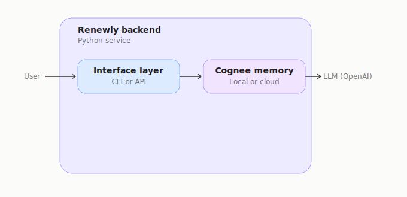
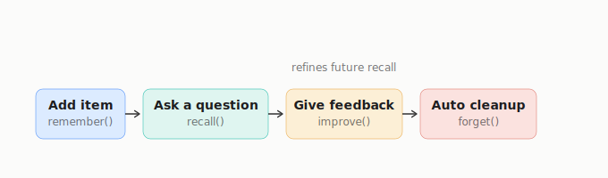

# ♻️ Renewly — Life-Admin Memory Agent

> **One codebase. Two backends. Zero forgotten renewals.**

[](https://python.org)
[](https://fastapi.tiangolo.com)
[](https://cognee.ai)
[](https://opensource.org/licenses/MIT)

## 🏗️ The Dual-Mode Architecture

The single most differentiating engineering decision in Renewly is its dual-mode architecture: **one codebase, two completely swappable backends**. By changing a single environment variable (`RENEWLY_BACKEND`), the entire system seamlessly switches between a local, file-based data store (using SQLite/LanceDB) and a hosted Cognee Cloud backend. This satisfies both open-source privacy needs and scalable cloud deployment, while keeping application logic completely unaware of which graph storage is active.

## 🧠 Architecture & Lifecycle





## 🚀 Quickstart

To get your personal agent running locally:

```bash
# 1. Clone the repository
git clone https://github.com/PraveenNPatil07/Renewly.git
cd Renewly/renewly

# 2. Install the package and dependencies
pip install -e ".[dev]"

# 3. Configure environment variables
cp .env.example .env
```

Open `.env` and fill in `OPENAI_API_KEY` to enable the LLM-powered text extraction (without it, the agent falls back to strict regex heuristics).

```bash
# 4. Run the local smoke test
python -m interface.cli ask "what subscriptions do I have?"
```

## 💻 Usage Examples

Below are real CLI invocations showing how to interact with your agent.

### 📥 1. Ingesting an Item
```bash
python -m interface.cli add "Netflix subscription renews on 2025-08-15, $15.99/month"
```
**Output:**
```text
>> Ingesting: Netflix subscription renews on 2025-08-15, $15.99/month...

[OK] Stored successfully!
   Item ID  : b91acdca-4b95-44fa-9110-7fcbf175b219
   Name     : Netflix
   Category : subscription
   Vendor   : Netflix
   Key Date : 2025-08-15
   Price    : $15.99
```

### 🗣️ 2. Asking Questions
```bash
python -m interface.cli ask "what subscriptions do I have?"
```
**Output:**
```text
[?] Querying: what subscriptions do I have?

You currently have the following subscriptions:

1. **Netflix**: 
   - Price: $15.99 (active until August 15, 2025)
   - Price: $15.99 (active starting July 15, 2026)

2. **Gym Membership**: 
   - Price: $50.00 (active starting July 10, 2026)

These are the active subscriptions you have at the moment. If you need more details or assistance with anything else, feel free to ask!
```

### 🔄 3. Feedback Loop (Learning Agent)
```bash
python -m interface.cli feedback b91acdca-4b95-44fa-9110-7fcbf175b219 too_early
```
**Output:**
```text
[OK] Feedback recorded: item 'b91acdca-4b95-44fa-9110-7fcbf175b219' -> 'too_early'
   The agent will adjust future reminder timing for this category.
```

### 📅 4. Running a Digest
```bash
python -m interface.cli digest
```
**Output:**
```text
digest generated at 2026-07-05 22:38

============================================================
🗓️  RENEWLY REMINDER DIGEST  [2026-07-05 22:38]
============================================================
In the next 7 days, the following items are expiring:

1. **Dell XPS Laptop** - This item is set to expire on **July 1, 2026**.
2. **Gym Membership** - This subscription will expire on **July 10, 2026**.
3. **Netflix Subscription** - One of your Netflix subscriptions is expiring on **July 15, 2026**.

Make sure to take any necessary actions regarding these items before their expiration dates!
============================================================
```

### 🧹 5. Cleaning Up Stale Items
```bash
python -m interface.cli cleanup
```
**Output:**
```text
[~] Running cleanup -- scanning for stale items...

[OK] Nothing to prune -- memory is clean.
```

## 📁 Project Structure

```text
renewly/
├── config.py                     # Configures env vars and selects MemoryPort adapter
├── domain/                       # Pure python domain logic and models (no I/O dependencies)
├── memory/                       # The MemoryPort ABC interface and swappable local/cloud adapters
├── application/                  # Core services (Ingestion, Query, Feedback, Cleanup) orchestrating workflows
├── interface/                    # Entry points (CLI and FastAPI routes) containing zero business logic
├── scheduler/                    # Simulated background tasks (e.g., cron-job reminder digests)
└── tests/                        # Fast, adapter-mocked test suite decoupled from external services
```

## 🎯 Design Decisions

| Decision | Reason |
|----------|--------|
| **Dependency Inversion (MemoryPort)** | Services depend on an abstract interface, not Cognee directly. Enables mock testing and switching backends instantly. |
| **Backend Toggle (`RENEWLY_BACKEND`)** | A single env var wires the correct adapter at startup, solving local privacy vs cloud scalability without touching business logic. |
| **`related_item_ids` as a Graph Edge** | Makes relationships first-class citizens instead of bolting them on via SQL foreign keys, allowing cross-entity queries. |
| **`improve()` as a Core Method** | Prevents Renewly from being a static database by introducing a feedback loop that adjusts reminder cadences, making it a true *agent*. |
| **Category as Data, Not Code** | Categories are Enums (`Category.SUBSCRIPTION`, etc.), not polymorphic classes, drastically reducing boilerplate and keeping logic central. |

## 🧪 Testing

Renewly embraces strict layering to make testing blazing fast. You do not need real Cognee or OpenAI calls to run the standard unit test suite.

Run the fast unit suite (uses in-memory `FakeMemoryPort`):
```bash
pytest tests/
```

Run the slow integration test suite (actually touches Cognee and the LLM, making network calls):
```bash
pytest tests/ -m integration
```

## 🚧 Known Limitations / Explicit Non-Goals

We believe an honest README builds trust. Here is exactly what Renewly deliberately **does not** do at this time:
- **No email ingestion**: There is no OAuth inbox scanning. Ingestion happens strictly via explicit CLI/API calls.
- **No real push notifications**: The digest scheduler simply `print()`s to stdout. It does not send SMS, Slack, or Email notifications.
- **No multi-user authentication**: The system is currently single-user. Scaling to multi-user requires namespacing the graph and adding interface auth, which are intentionally out of scope for this hackathon pass.

## 🙏 Credits
- Built for the **WeMakeDevs** Hackathon.
- Powered fundamentally by the **Cognee** knowledge graph framework.

## 📜 License
MIT License. See [LICENSE](LICENSE) for details.
